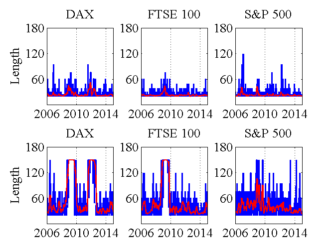

[](http://quantlet.de/)

## [](http://quantlet.de/) **LCARE_Adaptive_Estimation_Length_001** [](http://quantlet.de/)

```yaml

Name of Quantlet : LCARE_Adaptive_Estimation_Length_001

Published in : LCARE

Description : 'Estimates length of the interval of homogeneity in trading days across the selected
three stock markets from 3 January 2006 to 31 December 2014 for the modest (upper panel, r = 0.5)
and the conservative (lower panel, r = 1) risk cases, at expectile level 0.01.'

Keywords : 'plot, estimation, time-series, process, basis, model, risk, parameter, parametric,
threshold, expectile'

See also : 'LCARE_Adaptive_Estimation_005, LCARE_Adaptive_Estimation_001,
LCARE_Adaptive_Estimation_Length_005'

Author : Andrija Mihoci, Xiu Xu

Submitted : Sat, November 14 2015 by Xiu Xu

```




### MATLAB Code:
```matlab

% tau = 0.01

clear all; clc; 

load('LCARE_001.mat');

llen_DAX_001_c  = lcare_DAX_001_c(11, :)';
llen_FTSE_001_c = lcare_FTSE_001_c(11, :)';
llen_SP_001_c   = lcare_SP_001_c(11, :)';
llen_DAX_001_d  = lcare_DAX_001_d(11, :)';
llen_FTSE_001_d = lcare_FTSE_001_d(11, :)';
llen_SP_001_d   = lcare_SP_001_d(11, :)';
len_001         = [llen_DAX_001_c llen_FTSE_001_c  llen_SP_001_c ...
                   llen_DAX_001_d  llen_FTSE_001_d llen_SP_001_d];

% smooth line              
lcare_length_001_d_week = Smooth_mean(len_001, 20);   

figure
subplot(2, 3, 1); 
plot(lcare_DAX_001_c(11, :), '-b', 'LineWidth', 1.5); 
title('DAX', 'FontName', 'Times New Roman', 'FontSize', 16); 
set(gca, 'FontName', 'Times New Roman', 'FontSize', 16);  
hold on; 
plot(lcare_length_001_d_week(:, 1), '-r', 'LineWidth', 1.5); 
ylabel('Length'); 
ylim([1, 180]); 
xlim([1, 2348]); 
Year   = {'2006', '2010', '2014'}; 
hold on; 
set(gca, 'xtick', [1 1045 2088]);
Length = {'60', '120', '180'}; 
hold on; 
set(gca, 'ytick', [60 120 180]);
set(gca, 'xticklabel', Year); 
set(gca, 'yticklabel', Length); 
set(gca, 'xgrid', 'on')

subplot(2, 3, 2); 
plot(lcare_FTSE_001_c(11, :), '-b', 'LineWidth', 1.5); 
title('FTSE 100', 'FontName', 'Times New Roman', 'FontSize', 16); 
set(gca, 'FontName', 'Times New Roman', 'FontSize', 16);  
hold on; 
plot(lcare_length_001_d_week(:, 2), '-r', 'LineWidth', 1.5);
ylim([1, 180]); 
xlim([1, 2348]); 
Year   = {'2006', '2010', '2014'}; 
hold on; 
set(gca, 'xtick', [1 1045 2088]);
Length = {'60', '120', '180'}; 
hold on; 
set(gca, 'ytick', [60 120 180]);
set(gca, 'xticklabel', Year); 
set(gca, 'yticklabel', Length); 
set(gca, 'xgrid', 'on')

subplot(2, 3, 3); 
plot(lcare_SP_001_c(11, :), '-b', 'LineWidth', 1.5); 
title('S&P 500');
title('S&P 500', 'FontName', 'Times New Roman', 'FontSize', 16); 
set(gca, 'FontName', 'Times New Roman', 'FontSize', 16);  
hold on; 
plot(lcare_length_001_d_week(:, 3), '-r', 'LineWidth', 1.5);
ylim([1, 180]); 
xlim([1, 2348]); 
Year   = {'2006', '2010', '2014'}; 
hold on; 
set(gca, 'xtick', [1 1045 2088]);
Length = {'60', '120', '180'}; 
hold on; 
set(gca, 'ytick', [60 120 180]);
set(gca, 'xticklabel', Year); 
set(gca, 'yticklabel', Length); 
set(gca, 'xgrid', 'on')

subplot(2, 3, 4); 
plot(lcare_DAX_001_d(11, :), '-b', 'LineWidth', 1.5);
title('DAX', 'FontName', 'Times New Roman', 'FontSize', 16); 
set(gca, 'FontName', 'Times New Roman', 'FontSize', 16);  
hold on; 
plot(lcare_length_001_d_week(:, 4), '-r', 'LineWidth', 1.5);
ylabel('Length'); 
ylim([1, 180]); 
xlim([1, 2348]); 
Year   = {'2006', '2010', '2014'}; 
hold on; 
set(gca, 'xtick', [1 1045 2088]);
Length = {'60', '120', '180'}; 
hold on; 
set(gca, 'ytick', [60 120 180]);
set(gca, 'xticklabel', Year); 
set(gca, 'yticklabel', Length); 
set(gca, 'xgrid', 'on')

subplot(2, 3, 5); 
plot(lcare_FTSE_001_d(11, :), '-b', 'LineWidth', 1.5);
title('FTSE 100', 'FontName', 'Times New Roman', 'FontSize', 16); 
set(gca, 'FontName', 'Times New Roman', 'FontSize', 16);  
hold on; 
plot(lcare_length_001_d_week(:, 5), '-r', 'LineWidth', 1.5); 
ylim([1, 180]); 
xlim([1, 2348]); 
Year   = {'2006', '2010', '2014'}; 
hold on; 
set(gca, 'xtick', [1 1045 2088]);
Length = {'60', '120', '180'}; 
hold on; 
set(gca, 'ytick', [60 120 180]);
set(gca, 'xticklabel', Year); 
set(gca, 'yticklabel', Length); 
set(gca, 'xgrid', 'on')

subplot(2, 3, 6); 
plot(lcare_SP_001_d(11, :), '-b', 'LineWidth', 1.5);
title('S&P 500', 'FontName', 'Times New Roman', 'FontSize', 16); 
set(gca, 'FontName', 'Times New Roman', 'FontSize', 16);  
hold on; 
plot(lcare_length_001_d_week(:, 6), '-r', 'LineWidth', 1.5);
ylim([1, 180]); 
xlim([1, 2348]); 
Year   = {'2006', '2010', '2014'}; 
hold on; 
set(gca, 'xtick', [1 1045 2088]);
Length = {'60', '120', '180'}; 
hold on; 
set(gca, 'ytick', [60 120 180]);
set(gca, 'xticklabel', Year); 
set(gca, 'yticklabel', Length); 
set(gca, 'xgrid', 'on')


```
