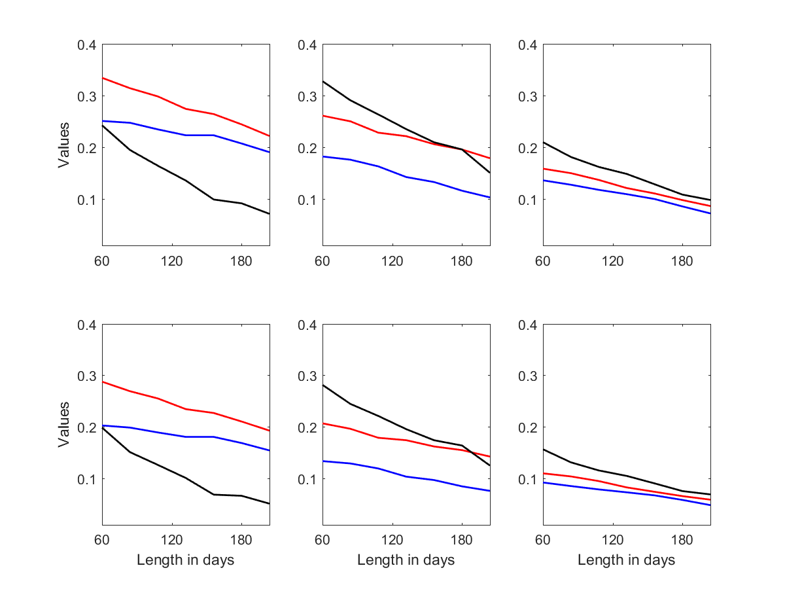

[](http://quantlet.de/index.php?p=info)

## [](http://quantlet.de/) **LCARE_Critical_Values** [](http://quantlet.de/d3/ia)


```yaml

Name of Quantlet: LCARE_Critical_Values

Published in: LCARE

Description: 'Plots the simulated critical values across different
parameter constellations for the modest
(upper panel, r = 0.5) and conservative
(lower panel, r = 1) risk cases, for two expectile
levels: 0.05 (blue) and 0.01 (red).'

Keywords:
- plot
- time-series
- process
- data
- basis
- model   
- risk
- parameter
- parametric
- threshold

See also: 
- LCARE_Critical_Values_Th1_001
- LCARE_Critical_Values_Th1_005
- LCARE_Critical_Values_Th2_001
- LCARE_Critical_Values_Th2_005
- LCARE_Critical_Values_Th3_001
- LCARE_Critical_Values_Th3_005

Author: Andrija Mihoci, Xiu Xu

Submitted:  Sat, November 14 2015 by Xiu Xu

Datafile: 
- z_k_Th1_001
- z_k_Th2_001
- z_k_Th3_001
- z_k_Th1_005
- z_k_Th2_005
- z_k_Th3_005

Output:
- LCARE_Critical_Values.png

```




```R


clear all; clc;

% Critical Value 
z_k_Th2_005 = load('z_k_Th2_005');
z_k_Th1_005 = load('z_k_Th1_005');
z_k_Th3_005 = load('z_k_Th3_005');
z_k_Th1_001 = load('z_k_Th1_001');
z_k_Th2_001 = load('z_k_Th2_001');
z_k_Th3_001 = load('z_k_Th3_001');
z_005       = [z_k_Th1_005, z_k_Th2_005, z_k_Th3_005];
z_001       = [z_k_Th1_001, z_k_Th2_001, z_k_Th3_001];
z           = [z_005, z_001];

%% figure
k = (1 : 1 : size(z, 1))';
figure;
subplot(2, 3, 1);
plot(k, z(:, 1), '-b', 'LineWidth', 1.3);
hold on 
plot(k, z(:, 7), '-r', 'LineWidth', 1.3);
ylabel('Values')
ylim([0, 20]);
xlim([1, 10]);

subplot(2, 3, 2);
plot(k, z(:, 3), '-b', 'LineWidth', 1.3);
hold on 
plot(k, z(:, 9), '-r','LineWidth', 1.3);
ylim([0, 20]);
xlim([1, 10]);

subplot(2, 3, 3);
plot(k, z(:, 5), '-b', 'LineWidth', 1.3);
hold on 
plot(k, z(:, 11), '-r', 'LineWidth', 1.3);
ylim([0, 20]);
xlim([1, 10]);

subplot(2, 3, 4);
plot(k, z(:, 2), '-b', 'LineWidth', 1.3);
hold on 
plot(k, z(:, 8), '-r', 'LineWidth', 1.3);
xlabel('Length in days')
ylabel('Values')
ylim([0, 400]);
xlim([1, 10]);

subplot(2, 3, 5);
plot(k, z(:, 4), '-b', 'LineWidth', 1.3);
hold on 
plot(k, z(:,10), '-r', 'LineWidth', 1.3);
xlabel('Length in days')
ylim([0, 400]);
xlim([1, 10]);

subplot(2, 3, 6);
plot(k, z(:, 6), '-b', 'LineWidth', 1.3);
hold on 
plot(k, z(:, 12), '-r', 'LineWidth', 1.3);
ylim([0, 400]);
xlim([1, 10]);
xlabel('Length in days')

