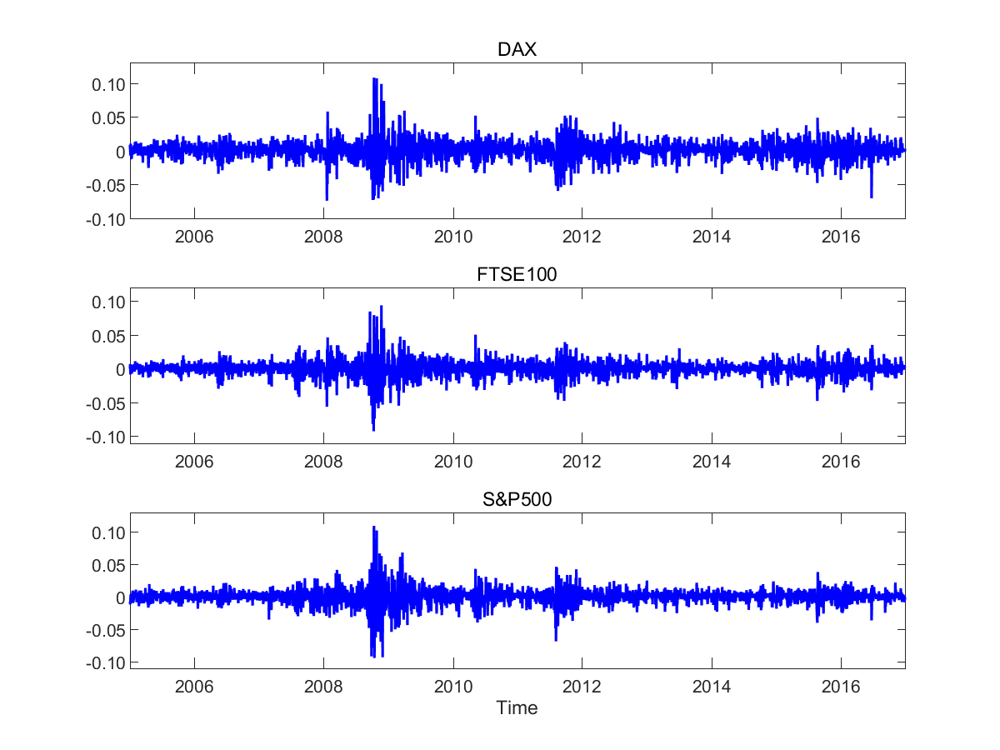

[](http://quantlet.de/index.php?p=info)

## [](http://quantlet.de/) **LCARE_Index_Returns** [](http://quantlet.de/d3/ia)


```yaml

Name of QuantLet : LCARE_Index_Returns

Published in : LCARE

Description : 'Plots selected index return time series from 3 January 
2005 to 31 December 2014 (2608 trading days)'

Keywords:
- risk management
- index
- returns
- plot
- time-series
- dax
- ftse100

See also: 
- LCARE_Index_Returns_Description

Author: Andrija Mihoci, Xiu Xu

Submitted:  Sat, November 07 2015 by Andrija Mihoci and Xiu Xu

Datafile: DataIndices.dat

Example: Plots of selected index return time series

```




```R

 
clear all; clc;
 
data   = load('DataIndices.dat');
r_DAX  = diff(log(data(:, 1)));       % r_DAX daily data
r_FTSE = diff(log(data(:, 2)));       % r_FTSE daily data
r_SP   = diff(log(data(:, 3)));       % r_SP daily data
n      = length(data) - 1;
 
figure;
subplot(3, 2, 1); plot(r_DAX, '-b', 'LineWidth', 1.5); 
title('DAX');
ylabel(''); xlim([1, 2608]); ylim([-0.10, 0.13]); 
Year  = {'2006', '2008', '2010', '2012','2014'}; hold on; 
set(gca, 'xtick', [261 782 1305 1826 2348]);
Value = {'-0.10', '-0.05', '0', '0.05', '0.10'}; hold on; 
set(gca, 'ytick', [-0.10 -0.05 0 0.05 0.10]);
set(gca, 'xticklabel', Year); set(gca, 'yticklabel', Value);
 
subplot(3, 2, 3); plot(r_FTSE, '-b', 'LineWidth', 1.5); 
title('FTSE100');
ylabel(''); xlim([1, 2608]); ylim([-0.11, 0.12]); 
Year  = {'2006', '2008', '2010', '2012','2014'}; hold on; 
set(gca, 'xtick', [261 782 1305 1826 2348]);
Value = {'-0.10', '-0.05', '0', '0.05', '0.10'}; hold on; 
set(gca, 'ytick', [-0.10 -0.05 0 0.05 0.10]);
set(gca, 'xticklabel', Year); set(gca, 'yticklabel', Value);
 
subplot(3, 2, 5); plot(r_SP, '-b', 'LineWidth', 1.5); 
title('S&P500');
ylabel(''); xlim([1, 2608]); ylim([-0.11, 0.13]); 
Year  = {'2006', '2008', '2010', '2012','2014'}; hold on; 
set(gca, 'xtick', [261 782 1305 1826 2348]);
Value = {'-0.10', '-0.05', '0', '0.05', '0.10'}; hold on; 
set(gca, 'ytick', [-0.10 -0.05 0 0.05 0.10]);
set(gca, 'xticklabel', Year); set(gca, 'yticklabel', Value);
xlabel('Time')
 


```
